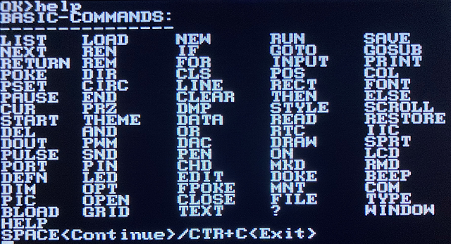
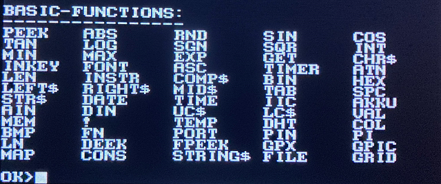
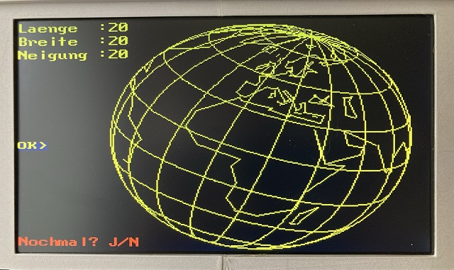
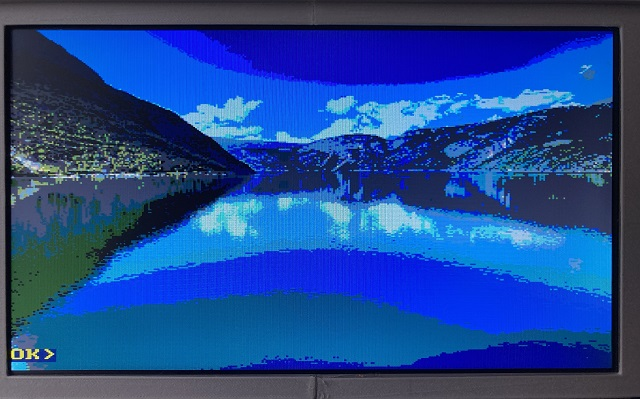
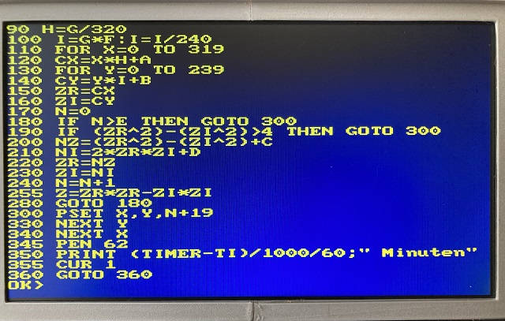
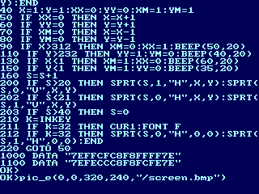
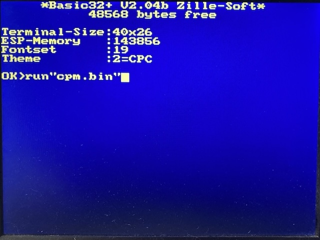

# ESP32-Basic with FabGL VGA library + PS2-Keyboard
### Basic32+ with FabGL VGA library + PS2 PS2Controller for VGA monitor output - 2019 - 2023       
#### Ursprungsversion von: Rob Cai <rocaj74@gmail.com>
#### erweitert/modifiziert von:Reinhard Zielinski <zille09@gmail.com>                                                                   
#### Das Ergebnis ist ein kleiner Retro-Computer mit folgender Ausstattung:
- (Schaltplan siehe Ordner Schematic) 

## Hardware:
```
-ESP32 / 240MHz
-56472 Basic Bytes free
-VGA-Display 320x240 Pixel 64 Farben oder 400x300 Pixel 64 Farben oder AV (IO26)
-IO-Erweiterung mit MCP23017 (2x8 IO-Ports) + EEPROM 512kB 
-128kB SPI-RAM oder 8MB PSRAM oder 512kB FRAM(Adafruit SPI FRAM)
-PS2-Keyboard 
-RTC DS3231 
-SD-Card
```


## Software:
```
Die Ursprungsversion wurde durch folgende Funktionen erweitert  

-fliesskomma Arithmetik
-Grafikfunktionen 	
-mathematische Funktionen 	
-Stringfunktionen 	
-lange Variablennamen  	
-viele zusätzliche Befehle (DATA,READ,STRG$,LEFT$,RIGHT$,MID$,POS,TAB,SPC,SIN,COS,TAN,ATN,LOG,SQR,PI usw.) 	
-erweiterte logische Operatoren (AND, OR) 	
-BIT-Manipulation &,|,%,<<,>> usw. 	
-Klammerrechnung 	
-IF THEN ELSE Abfragen 	
-Speichermonitor 	
-Exponential-Ein/Ausgabe 	
-Verschiedene Sensoren und Komponenten HC-S04, Dallas DS18S20, DHT, LCD, Neopixel-LED, BMP180 	
-Zeileneditor 
-BMP-Bilddatei-Import / Export
-Spritefunktionen (noch in der Entwicklung)
-Soundfunktionen (noch in der Entwicklung)
-integrierte Kurzhilfe
-RUN-CPM kann mit BLOAD"/cpm.bin" gestartet werden (Rückkehr mit EXIT)

```

***Special Thanks on Guido Lehwalder and Marcelo Dantas ->RUN-CPM is a great Work!***

***Also thanks on Fabrizio Di Vittorio for the excellent FabGl-Library***


 
```
-Startbildschirm
```


```
-Basic-Befehle
```

 
```
-Basic -Funktionen
```



```
-Programm Globus.Bas
```


```
-Darstellung einer BMP-Datei
```


```
-Programmlisting
```


```
Screenshot als BMP-Datei exportiert
```


```
...mit RUN kann dann auch CPM gestartet werden.
```


```
...RUN-CPM Startbildschirm , mit EXIT kehrt man wieder zum Basic32+ zurück.
```


```
...der GRID-Befehl in Aktion .
```


## Bibliotheken einbinden und Basic32+ compilieren:
```
-die im Ordner libraries liegenden Unterverzeichnisse ins Arduino libraries-Verzeichnis kopieren

-zusätzlich die FabGL-lib mit dem Bibliotheksmanager der Arduino-IDE installieren

-die Quellen befinden sich im Ordner "src/FabGL-Basic" ->kompilieren und in den ESP32 laden

-den Inhalt des Verzeichnisses SD-Card auf eine SD-Karte kopieren .... und mit ESP32+Basic loslegen :-)

Im Ordner RUN-CPM befindet sich die um den OTA-Loader erweiterte Variante, um nach Eingabe von EXIT wieder zum Basic zurückzukehren.
```

## Komponenten:

-ESP32 NodeMCU https://www.berrybase.de/esp32-nodemcu-development-board?sPartner=g_shopping&gclid=EAIaIQobChMI-fTJwNmx_wIVkupRCh1mTAgZEAQYBSABEgKjwvD_BwE

-MCP23017 https://www.reichelt.de/i-o-erweiterung-16bit-1-8-5v-seriell-i2c-dip-28-mcp-23017-e-sp-p140074.html?&trstct=pos_0&nbc=1

-FRAM 512kB https://www.adafruit.com/product/4719

-SD-Card Modul https://www.reichelt.de/arduino-sd-karten-modul-ard-module-sd-p282683.html?PROVID=2788&gclid=EAIaIQobChMIqL3-sdqx_wIVQ9rVCh1oSQiAEAQYAiABEgL9BPD_BwE

-RTC-Modul https://www.reichelt.de/entwicklerboards-praezisions-echtzeituhr-ds3231-debo-rtc-uhr2-p235506.html?PROVID=2788&gclid=EAIaIQobChMImaDrzNqx_wIVQs7VCh1VowhwEAQYBCABEgLQoPD_BwE

-siehe auch BOOM-List im Ordner Schematic ->folgt bald

 ### Author:Reinhard Zielinski <zille09@gmail.com> April 2021
